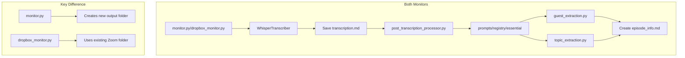

# Application Functionality

## Core Components

### 1. Monitor Systems
The application has two monitoring systems:

#### Standard Monitor (`monitor.py`)
- Watches a designated directory for any new M4A files
- Creates new folders in `output/` directory for each transcription
- Folder name is based on the original audio file name

#### Dropbox Monitor (`dropbox_monitor.py`)
- Specifically watches for Zoom recording folders
- Uses existing Zoom folder structure
- Includes additional file handling:
  - Waits for files to be fully written
  - Verifies file completion
  - Handles file moves and renames

### 2. Transcription Service (`transcriber.py`)
- Handles both monitor types
- File size management:
  - 25MB limit for direct transcription
  - Compresses larger files with progressive bitrate reduction
- OpenAI Whisper API integration
- Creates two key files:
  - `transcription.md`: Contains timestamped transcription
  - Triggers post-transcription processing

### 3. Post-Processing (`post_transcription_processor.py`)
Used by both monitoring systems to:
- Extract guest information
- Extract topic information
- Create `episode_info.md`

### 4. Prompts Registry
Located in `prompts/registry/essential/`:
- `guest_extraction.py`: Extracts guest name from transcript
- `topic_extraction.py`: Identifies main episode topic
- Used consistently across both monitoring systems

## File Processing Flow



## Output Structure

Both monitoring systems produce identical file outputs:
```
[folder_name]/
├── transcription.md    # Timestamped transcript
└── episode_info.md     # Guest and topic information
```

The only difference is the location:
- Standard monitor: Creates in `output/[audio_filename]/`
- Dropbox monitor: Uses existing `[zoom_folder]/`

## Current Development Status

The system successfully:
1. Monitors for new recordings
2. Transcribes audio content
3. Extracts episode metadata
4. Creates organized output files

Next planned feature:
- Folder renaming functionality using pattern: "Guest Name - Topic - YYYY-MM-DD"
